# WonderTANG
## TangNano 20K cartridge for MSX computers

This cartridge allows any MSX computer to host a Sipeed Tang Nano 20K. The current fpga core implements:

- MicroSD Nextor 2.1 Drive
- FM OPLL + MSX Music ROM
- 2MB Super Mega RAM SCC+
- 4MB Memory Mapper
- Sega Master System VDP + PSG to allow running SMS roms from SofaRun (Franky HDMI)

## The Super Mega RAM SCC+

The Super Mega RAM SCC+ is a different ACVS-like MegaRam that support different mappers:

- Konami4 (2MB)
- Konami5 SCC+ (512KB)
- ASCII8 (2MB)
- ASCII16 (2MB)

Use the utility SMRAM.COM to allow using different mappers as well activating the SCC+, otherwise it will just work like an ordinary MegaRAM 2MB.

## Board Revisions

The latest available version is [V2.0b](#v20av20b-new). Please, use that version to order new boards.

> [!IMPORTANT]
> Always check your board revision when assembling or programming your WonderTANG.
>
> The revision number is available on the front-left side of the board.
>
> Download the specific [FPGA Bitstream version](#fpga-bitstream-versions) required by your board version.

### [V2.0a/V2.0b (NEW)](https://github.com/lfantoniosi/WonderTANG/tree/4a21359a5136a5a96363da55edc5d934acfd37c5/kicad/)

This is the new version using Tang Nano 20K internal DAC amplifier.

Changes since last revision:
* uses internal DAC for audio output
* switches to a flatter audio connector
* removes jumpers
* requires the latest [FPGA bitstream version](#fpga-bitstream-versions)

V2.0a is equivalent to V2.0b.

|[](images/WonderTANG-V2.0a-front-build.jpg)|
|:--|
|V2.0a prototype build|

|[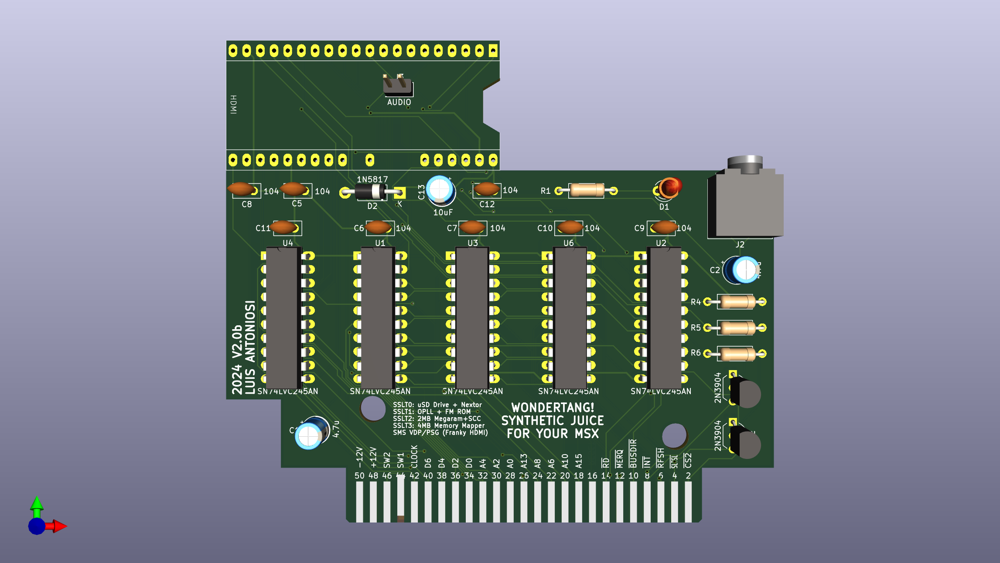](images/WonderTANG-V2.0b-front-render.png)|[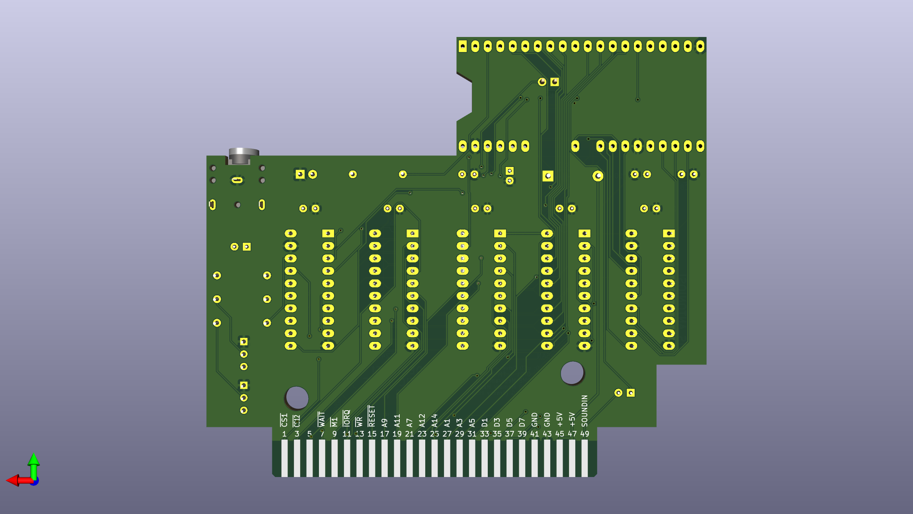](images/WonderTANG-V2.0b-back-render.png)|
|-|-|
|V2.0b front render|V2.0b back render|

#### PCB

You can access V2.0b gerber files from github at:

[https://github.com/lfantoniosi/WonderTANG/tree/4a21359a5136a5a96363da55edc5d934acfd37c5/kicad/gerber](https://github.com/lfantoniosi/WonderTANG/tree/4a21359a5136a5a96363da55edc5d934acfd37c5/kicad/gerber)

Or you can order V2.0a PCBs directly from:

[https://www.pcbway.com/project/shareproject/WonderTANG_v2_00a_a813663c.html](https://www.pcbway.com/project/shareproject/WonderTANG_v2_00a_a813663c.html)

<a href="https://www.pcbway.com/project/shareproject/WonderTANG_v2_00a_a813663c.html"></a>

A small part of the money will be donated to the author of the project.

#### Bill of Materials

| Reference                   | Value                      | Description                                          | Qty | Link        |
|-----------------------------|----------------------------|------------------------------------------------------|-----|-------------|
| C5, C6, C7, C8, C9, C10, C11, C12 | DIP-100NF                  | MLCC Monolithic Ceramic Capacitor DIP 100nF (104)     | 8   | AliExpress  |
| C1, C2                      | ELEC-DIP-4.7UF-16V         | Electrolytic Capacitor DIP 4.7uF 16V                 | 2   | AliExpress  |
| C13                         | ELEC-DIP-10UF-16V          | Electrolytic Capacitor DIP 10uF 16V                  | 1   | AliExpress  |
| R5,R6                       | DIP-2.2K                   | Resistor PTH 2.2KR                                   | 2   | Aliexpress  |
| R1                          | DIP-330R                   | Resistor PTH 330R                                    | 1   | AliExpress  |
| R4                          | DIP-4.7K                   | Resistor PTH 4.7KR                                   | 1   | AliExpress  |
| D1                          | LED-3MM                    | LED 3MM Red                                          | 1   | AliExpress  |
| D2                          | 1N5817                     | SCHOTTKY BARRIER RECTIFIER DIODE                    | 1   | AliExpress  |
| U1, U2, U3, U4, U6          | SOCKET-DIP-NARROW-20       | DIP Socket Narrow 20 pins                            | 5   | AliExpress  |
| U1, U2, U3, U4, U6          | SN74LVC245AN               | OCTAL BUS TRANSCEIVER WITH 3-STATE OUTPUTS           | 5   | AliExpress  |
| Q1,Q2                       | 2N3904                     | 2N3904 NPN switching Transistor                      | 2   | AliExpress  |
| J2                          | CP1-3523N                  | CONN JACK STEREO 3.5MM R/A                           | 1   | AliExpress  |
| J3                          | Mini Micro male/female JST | Mini Micro male/female JST                           | 1   | AliExpress  |
| U5                          | Tang Nano 20K              | Tang Nano 20K                                        | 1   | AliExpress  |

#### Build Notes

The audio J3 needs to be soldered into the TANG Nano 20K speaker pins (two small pins between the words SiPEED and TANG NANO 20K, polarity does not matter). Use the JST connector or solder it directly under the board.

[](images/WonderTANG-V2.0a-front-build-audio-connector.jpg)


### [V1.02d (PREVIOUS)](https://github.com/lfantoniosi/WonderTANG/tree/0e938fb70acad34c753a95fd54bb3fdd6095d590/kicad/)

> [!WARNING]
> If you are building new boards, please use the latest available board revision instead.

This version fixes a problem with Philips MSX machines (detected on [Philips VG8235](https://www.msx.org/wiki/Philips_VG-8235) and [Philips NMS8245](https://www.msx.org/wiki/Philips_NMS_8245)) by properly implementing the MSX cartridge nINT signal as an open-collector.

Changes since last revision:
* uses a transistor to implement nINT as open-collector
* requires a specific [FPGA bitstream version](#fpga-bitstream-versions)

|[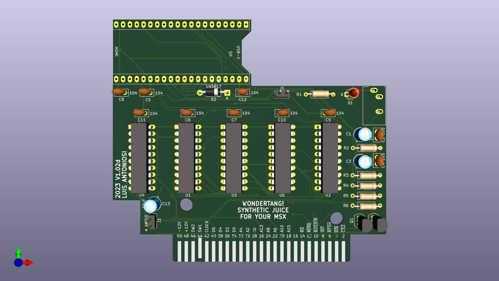](images/WonderTANG-V1.02d-front-render.png)|[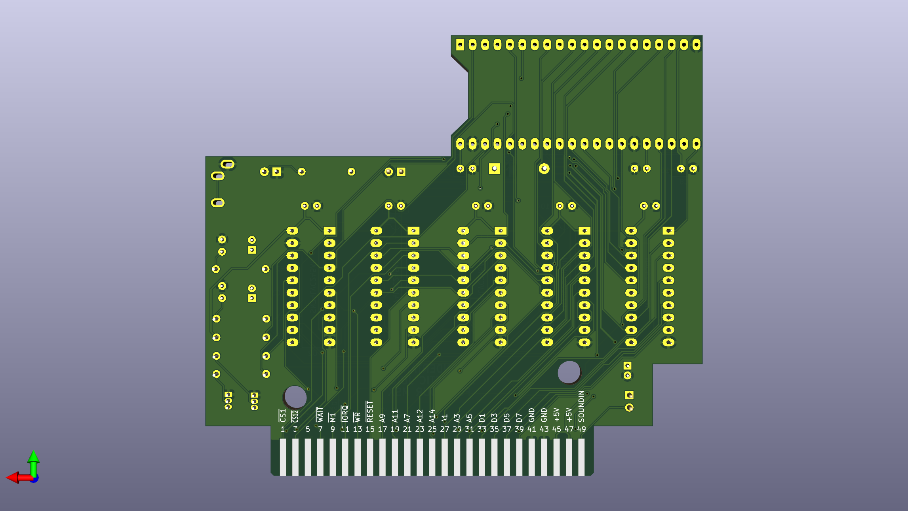](images/WonderTANG-V1.02d-back-render.png)|
|-|-|
|V1.02d front render|V1.02d back render|

#### PCB

You can access V1.02d gerber files from github at:

[https://github.com/lfantoniosi/WonderTANG/tree/0e938fb70acad34c753a95fd54bb3fdd6095d590/kicad/gerber](https://github.com/lfantoniosi/WonderTANG/tree/0e938fb70acad34c753a95fd54bb3fdd6095d590/kicad/gerber)

#### Bill of Materials

| Reference                   | Value                      | Description                                          | Qty | Link        |
|-----------------------------|----------------------------|------------------------------------------------------|-----|-------------|
| C5, C6, C7, C8, C9, C10, C11, C12 | DIP-100NF                  | MLCC Monolithic Ceramic Capacitor DIP 100nF (104)     | 8   | AliExpress  |
| C1, C3, C13                 | ELEC-DIP-10UF-16V          | Electrolytic Capacitor DIP 10uF 16V                  | 3   | AliExpress  |
| C2, C4                      | DIP-1UF                    | MLCC Monolithic Ceramic Capacitor DIP 1uF (105)      | 2   | AliExpress  |
| R2, R3                      | DIP-47R                    | Resistor PTH 47R                                     | 2   | AliExpress  |
| R5,R6                       | DIP-2.2K                   | Resistor PTH 2.2KR                                   | 2   | Aliexpress  |
| R1                          | DIP-330R                   | Resistor PTH 330R                                    | 1   | AliExpress  |
| R4                          | DIP-4.7K                   | Resistor PTH 4.7KR                                   | 1   | AliExpress  |
| D1                          | LED-3MM                    | LED 3MM Red                                          | 1   | AliExpress  |
| D2                          | 1N5817                     | SCHOTTKY BARRIER RECTIFIER DIODE                    | 1   | AliExpress  |
| U1, U2, U3, U4, U6          | SOCKET-DIP-NARROW-20       | DIP Socket Narrow 20 pins                            | 5   | AliExpress  |
| U1, U2, U3, U4, U6          | SN74LVC245AN               | OCTAL BUS TRANSCEIVER WITH 3-STATE OUTPUTS           | 5   | AliExpress  |
| Q1,Q2                       | 2N3904                     | 2N3904 NPN switching Transistor                      | 2   | AliExpress  |
| C13                         | ELEC-DIP-10UF-16V          | Electrolytic Capacitor DIP 10uF 16V                  | 1   | AliExpress  |
| C1, C2                      | ELEC-DIP-4.7UF-16V         | Electrolytic Capacitor DIP 7.7uF 16V                 | 2   | AliExpress  |
| J1, J3                      | PH-254-S-M-40-BLACK        | 2.54mm 1 x 40 Pin Male Single Row Pin Header Strip Black | 1 | AliExpress  |
| J2                          | SJ1-3533NG                 | SJ1-3533NG Audio P4 3 Pin connector                  | 1   | AliExpress  |
| U5                          | Tang Nano 20K              | Tang Nano 20K                                        | 1   | AliExpress  |


### [V1.01c (OBSOLETE)](https://github.com/lfantoniosi/WonderTANG/tree/b9e608418bb1917098046716af13b877def6737b/kicad/)

> [!WARNING]
> If you are building new boards, please use the latest available board revision instead.

This version corrects an audio problem due to wrong connection of AUDIO and SOUNDIN capacitors.

Changes since last revision:
* fix audio output
* requires an old [FPGA bitstream version](#fpga-bitstream-versions)

> [!IMPORTANT]
> This version is known to experience problems with some Philips MSX machines.

|[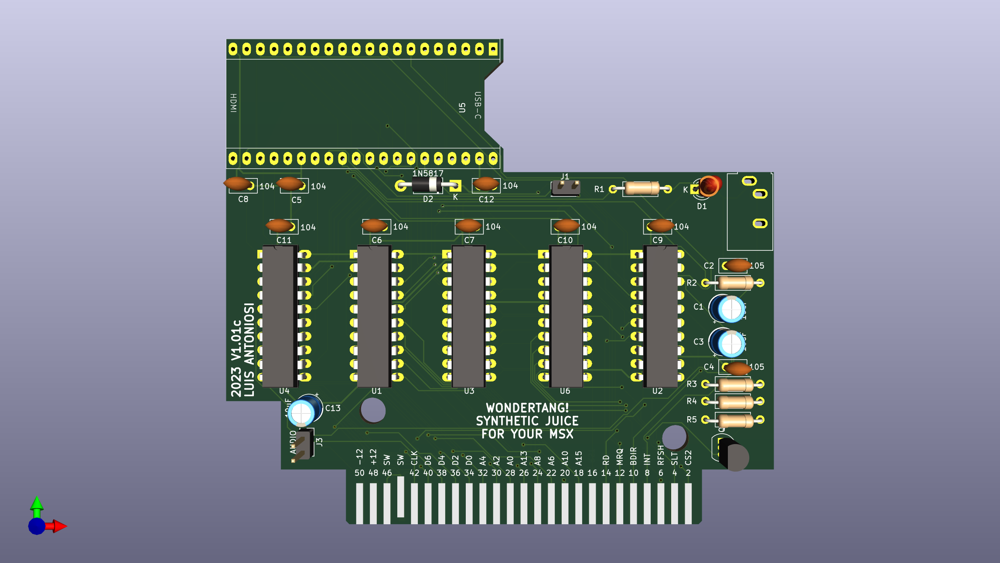](images/WonderTANG-V1.01c-front-render.png)|[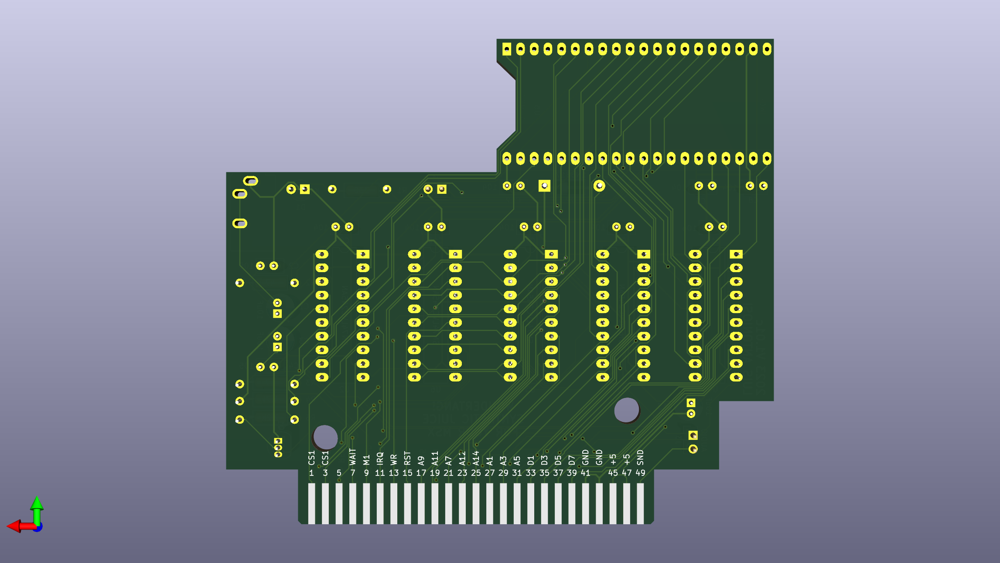](images/WonderTANG-V1.01c-back-render.png)|
|-|-|
|V1.01c front render|V1.01c back render|

#### PCB

You can access V1.01c gerber files from github at:

[https://github.com/lfantoniosi/WonderTANG/tree/b9e608418bb1917098046716af13b877def6737b/kicad/gerber](https://github.com/lfantoniosi/WonderTANG/tree/b9e608418bb1917098046716af13b877def6737b/kicad/gerber)

Or you can order V1.01c PCBs directly from:

[https://www.pcbway.com/project/shareproject/WonderTANG_v1_01c_ba2c16ea.html](https://www.pcbway.com/project/shareproject/WonderTANG_v1_01c_ba2c16ea.html)

<a href="https://www.pcbway.com/project/shareproject/WonderTANG_v1_01c_ba2c16ea.html"></a>

A small part of the money will be donated to the author of the project.

#### Bill of Materials

| Reference                   | Value                      | Description                                          | Qty | Link        |
|-----------------------------|----------------------------|------------------------------------------------------|-----|-------------|
| C5, C6, C7, C8, C9, C10, C11, C12 | DIP-100NF                  | MLCC Monolithic Ceramic Capacitor DIP 100nF (104)     | 8   | AliExpress  |
| C1, C3, C13                 | ELEC-DIP-10UF-16V          | Electrolytic Capacitor DIP 10uF 16V                  | 3   | AliExpress  |
| C2, C4                      | DIP-1UF                    | MLCC Monolithic Ceramic Capacitor DIP 1uF (105)      | 2   | AliExpress  |
| R2, R3                      | DIP-47R                    | Resistor PTH 47R                                     | 2   | AliExpress  |
| R1                          | DIP-330R                   | Resistor PTH 330R                                    | 1   | AliExpress  |
| R4                          | DIP-4.7K                   | Resistor PTH 4.7KR                                   | 1   | AliExpress  |
| R5                          | DIP-2.2K                   | Resistor PTH 2.2KR                                   | 1   |             |
| D1                          | LED-3MM                    | LED 3MM Red                                          | 1   | AliExpress  |
| D2                          | 1N5817                     | SCHOTTKY BARRIER RECTIFIER DIODE                    | 1   | AliExpress  |
| U1, U2, U3, U4, U6          | SOCKET-DIP-NARROW-20       | DIP Socket Narrow 20 pins                            | 5   | AliExpress  |
| U1, U2, U3, U4, U6          | SN74LVC245AN               | OCTAL BUS TRANSCEIVER WITH 3-STATE OUTPUTS           | 5   | AliExpress  |
| Q1                          | 2N3904                     | 2N3904 NPN switching Transistor                      | 1   | AliExpress  |
| J1, J3                      | PH-254-S-M-40-BLACK        | 2.54mm 1 x 40 Pin Male Single Row Pin Header Strip Black | 1 | AliExpress  |
| J2                          | SJ1-3533NG                 | SJ1-3533NG Audio P4 3 Pin connector                  | 1   | AliExpress  |
| U5                          | Tang Nano 20K              | Tang Nano 20K                                        | 1   | AliExpress  |


### [V1.01b (OBSOLETE)](https://github.com/lfantoniosi/WonderTANG/tree/09ee5923f52284835864b947fba076c70dbe0fab/kicad/)


### [V1.01 (OBSOLETE)](https://github.com/lfantoniosi/WonderTANG/tree/d6cbb30488c2db2edb72d424ac75a0af0b1afaa3/kicad/)


### [V1.0 (OBSOLETE)](https://github.com/lfantoniosi/WonderTANG/tree/ac242e77184eeba1786766e48963c7b3fef0f877/kicad/)


## FPGA Bitstream Versions

If you want to program your WonderTANG you need to download the specific FPGA bitstream for your board revision according to the following table.

| Board Revision | FPGA Bitstream File                                                                                                                 |
| -------------- | ----------------------------------------------------------------------------------------------------------------------------------- |
| V1.0           | [WonderTANG_v1.0-v1.01c.fs](https://github.com/lfantoniosi/WonderTANG/blob/main/fpga/impl/pnr/WonderTANG_v1.0-v1.01c.fs?raw=True)             |
| V1.01          | [WonderTANG_v1.0-v1.01c.fs](https://github.com/lfantoniosi/WonderTANG/blob/main/fpga/impl/pnr/WonderTANG_v1.0-v1.01c.fs?raw=True)             |
| V1.01b         | [WonderTANG_v1.0-v1.01c.fs](https://github.com/lfantoniosi/WonderTANG/blob/main/fpga/impl/pnr/WonderTANG_v1.0-v1.01c.fs?raw=True)             |
| V1.01c         | [WonderTANG_v1.0-v1.01c.fs](https://github.com/lfantoniosi/WonderTANG/blob/main/fpga/impl/pnr/WonderTANG_v1.0-v1.01c.fs?raw=True)             |
| V1.02d         | [WonderTANG_v1.02d.fs](https://github.com/lfantoniosi/WonderTANG/blob/main/fpga/impl/pnr/WonderTANG_v1.02d.fs?raw=True)                  |
| V2.0b          | [WonderTANG.fs](https://github.com/lfantoniosi/WonderTANG/blob/main/fpga/impl/pnr/WonderTANG.fs?raw=True)                         |


## Programming the Cartridge


### How to Program the Tang Nano 20K from Windows

Install the Gowin Educative IDE or just the programmer if you want to just flash the files on your board. You can install it from https://www.gowinsemi.com/ by providing your personal data and registering. Please reboot your computer after installing the drivers.

Connect your TangNano board to the computer USB and open the Gowin Programmer software. Please note that we will be just programming the board, so you will not effectively use the IDE at this time. You should see the following message indicating that your board/cable was recognized. 

NOTE: for version 2.0b the FPGA core re-uses JTAG pins. So once flashed to re-flash the tang you need to press S1 button on it before connecting the USB-C cable and keep it pressed during all the time of the flashing process.

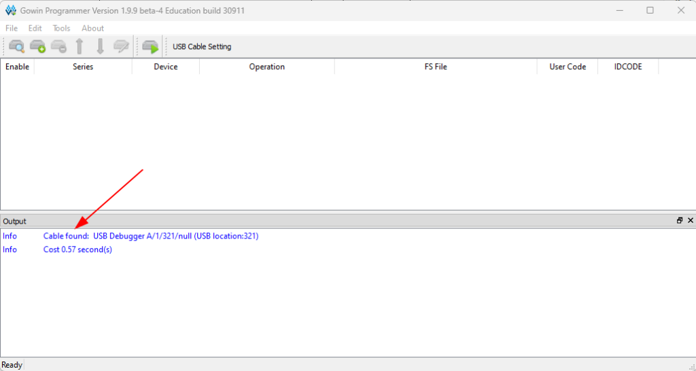

Click Add Device. You will see a new device on the list. Click on the Series and select GW2AR.

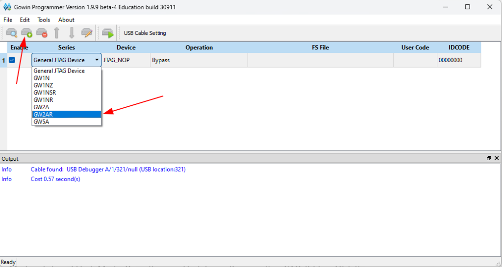

Now double click the device on the list and set Access Mode = External Flash Mode, Operation = exFlash Erase, Program thru GAO-Bridge. Click the elipsis and **select the __specific .fs file__ for your WonderTANG board revision** (see [FPGA bitstream versions](#fpga-bitstream-versions)). Select Generic Flash as the Device and make sure the address 0x000000 is selected. Click Save.

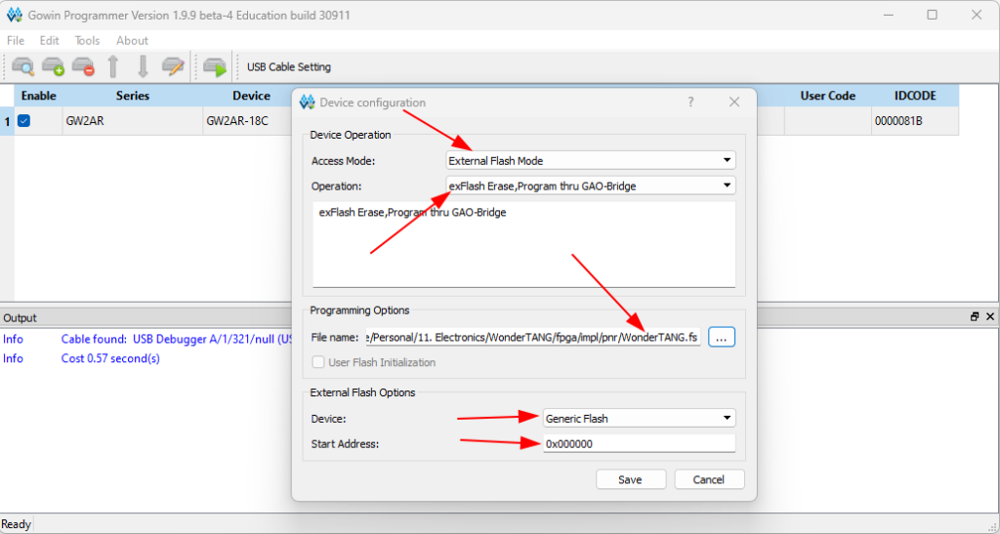

Click Add Device again. Set the Series to GW2AR. Double click on the device and set Access Mode = External Flash Mode, select Operation = exFlash C Bin Erase, Program thru GAO-Bridge. Click the elipsis and select the Nextor-2.1.1.WonderTANG.ROM.bin file. Select Generic Flash as the Device and make sure the address 0x100000 is selected. Click Save.

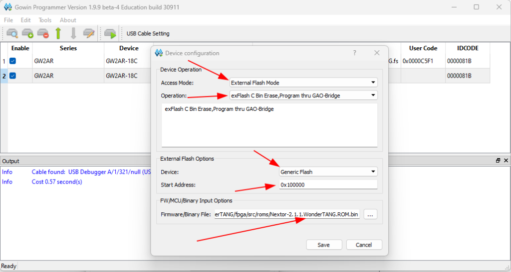

Now Enable just the first device on the list, go to the Edit menu and select Program/Configure (or click the program button).

<div style="display: flex; justify-content: space-between;">
    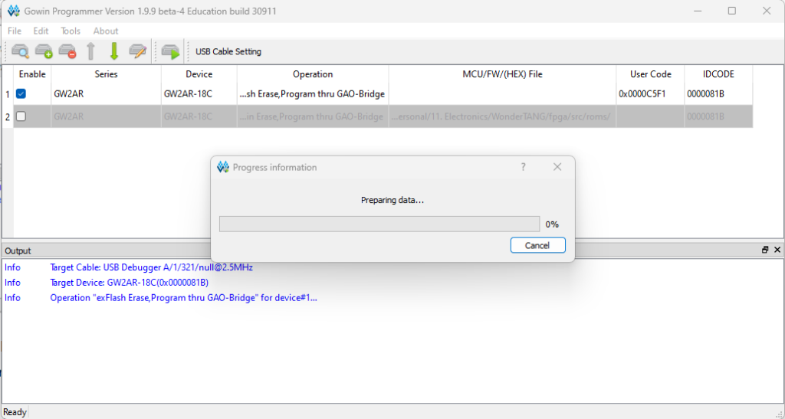 &nbsp;
    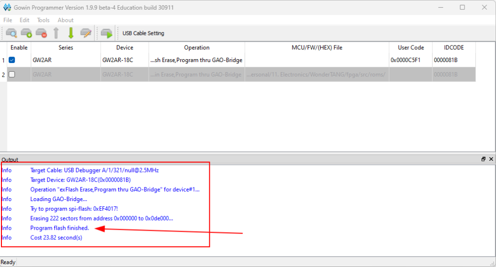
</div>
&nbsp;

Repeat the steps now enabling just the second device on the list. That will save the BIOS on the flash.

<div style="display: flex; justify-content: space-between;">
    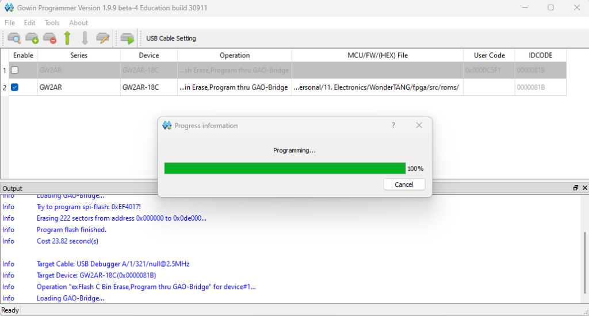 &nbsp;
    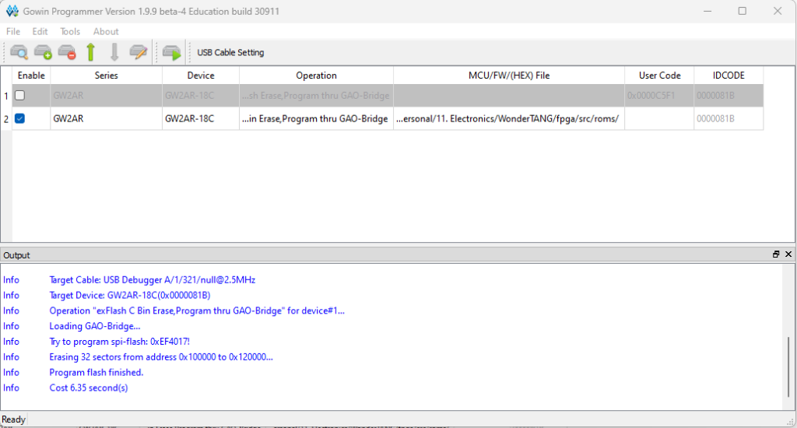
</div>
&nbsp;

### How to Program the Tang Nano 20K from Linux

As the native programmer of the Gowin IDE does not properly work in Linux, it is recommended to use [openFPGALoader](https://github.com/trabucayre/openFPGALoader) to program the Tang Nano 20K of the WonderTANG.

This procedure has been tested successfully using openFPGALoader v0.10.0.

Assuming that you already downloaded **the __specific .fs file__ for your WonderTANG board revision** (see [FPGA bitstream versions](#fpga-bitstream-versions)) and `Nextor-2.1.1.WonderTANG.ROM` files, and that your Tang Nano 20K is connected to your computer using a USB cable, you can proceed as follows:

* Upload the bitstream (in this case `path_to_your/WonderTANG/fpga/impl/pnr/WonderTang.fs`) using the following command:

```
openFPGALoader -f -b tangnano20k --external-flash path_to_your/WonderTANG/fpga/impl/pnr/WonderTANG.fs
```

* Upload the WonderTANG ROM file `path_to_your/WonderTANG/kernel/Tang/Nextor-2.1.1.WonderTANG.ROM` using the following command:

```
openFPGALoader -f -b tangnano20k --external-flash -o 1048576 path_to_your/WonderTANG/kernel/Tang/Nextor-2.1.1.WonderTANG.ROM
```
